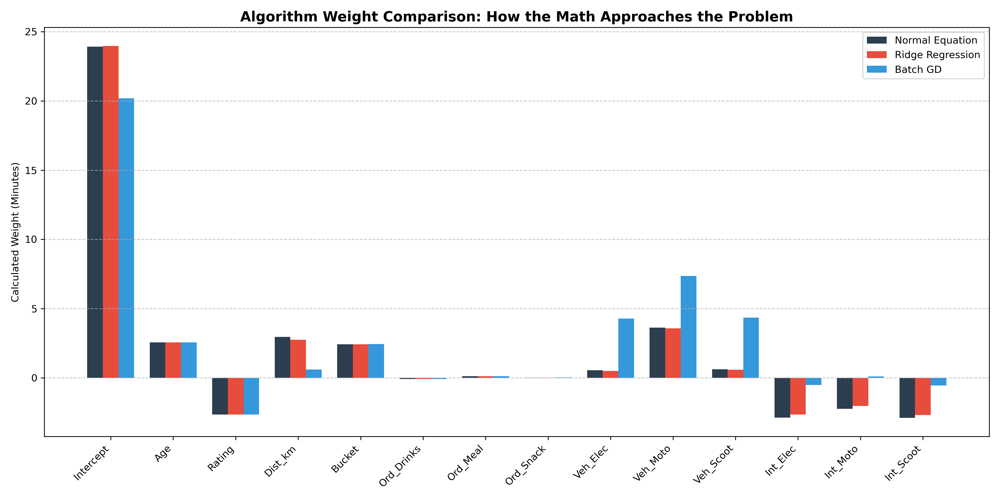
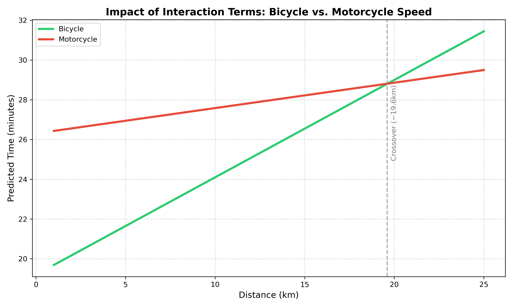
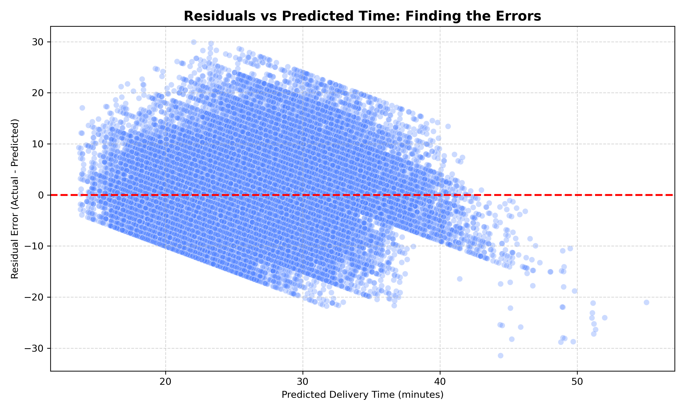

# 🍔 Food Delivery Time Predictor: From Raw Math to Production API

Instead of relying on black-box libraries like `scikit-learn` and simply calling `model.fit()`, this project builds the mathematical engines of Machine Learning entirely from the ground up using pure `NumPy`. 

This repository tackles the reality of messy, real-world logistics data. It demonstrates how to translate physical realities into strict matrix mathematics, diagnose model failures using residual analysis, and implement business-logic wrappers to handle the chaotic limits of linear algebra.

---

## 🧠 Core Mathematical Engines
This project implements three distinct flavors of Linear Regression from scratch:
* **Normal Equation (Closed-Form):** A direct matrix algebra approach `(X.T @ X)^-1 @ X.T @ y` to instantly calculate the absolute global minimum of the error valley.
* **Batch Gradient Descent (Iterative):** An iterative algorithmic approach to navigate the error gradient, essential for understanding how modern neural networks optimize weights.
* **Ridge Regression (L2 Regularization):** A penalized regression model `(X.T @ X + λI)^-1 @ X.T @ y` designed to act as a mathematical "shock absorber," preventing weights from overreacting to overlapping features. *(This is the primary model used for production inference).*

---

## 🚀 Key Technical Challenges Solved
* **The Dummy Variable Trap:** Safely One-Hot Encoding categorical data while dynamically dropping baselines to prevent singular matrix explosions (divide-by-zero errors).
* **Interaction Terms (Crossing Lines):** Standard linear regression forces parallel lines. By engineering interaction terms (e.g., `Distance * is_Motorcycle`), the model successfully learns unique speed slopes for different vehicles, allowing lines to "cross" mathematically.
* **Safe Data Scaling:** Implementing strict data pipelines to ensure continuous variables are scaled using training set Standard Deviations, while preserving the mathematical purity of `0` in dummy matrices to prevent data leakage.
* **Omitted Variable Bias:** Confronting the reality that missing data (like `Traffic_Density`) forces models to learn biased assumptions (e.g., bicycles appearing magically faster than motorcycles in cross-town trips).

---

## 📊 Model Diagnostics & Business Impact

Building the math is only 20% of the job; interpreting it is the other 80%.

### 1. Residual Analysis (The X-Ray)
By plotting the residual errors (`Actual Time - Predicted Time`), we can diagnose the exact limits of a linear model in the physical world:
* **Heteroscedasticity (The Cone):** The model is highly accurate on short deliveries but its error margin nearly doubles on long deliveries due to unmapped chaos (traffic, weather). 
* **The Physical Floor:** The errors form a hard diagonal cutoff at the bottom. A model might predict a 40-minute delivery arrives in 15 minutes, but it can never predict a 15-minute delivery arrives in -10 minutes.

### 2. Feature Importance
By analyzing the absolute magnitude of the Ridge Regression `theta` weights, we established exactly what drives delivery times:
* **High Impact:** Vehicle type (Motorcycle penalty), Distance, Driver Rating, and Driver Age.
* **Low/Zero Impact:** Order Type (Meal vs. Snack). The math proves that *what* the customer orders has almost zero impact on transit time.

### 3. Asymmetric Loss & Business Logic
In food delivery, errors are not created equal. Underestimating by 10 minutes causes customer churn and angry reviews. Overestimating by 10 minutes creates delight. To protect the user experience, the raw ML outputs are wrapped in an API layer that enforces localized business rules and safely biases predictions.

---

## 📈 Visualizing the Math

*(Note: The images below are generated from the raw NumPy arrays within the notebook)*

### Algorithm Weights Comparison
Notice how the Normal Equation acts as a baseline, Ridge gently squishes the One-Hot Encoded features to prevent overfitting, and Batch Gradient Descent approximates the closed-form solution iteratively.



### The Interaction Crossover
By scaling and applying Interaction Terms, the model calculates unique speed slopes. It correctly learns that bicycles win in short distances (downtown traffic), while motorcycles eventually overtake them at longer distances.



### The Error range: ACTUAL vs Predicted Time



---

## 🛠️ Tech Stack & Architecture
* **Math & Data Engineering:** `Python`, `NumPy`, `Pandas`, `Matplotlib`, `Seaborn`
* **Backend & Inference:** `FastAPI` (Loads `.pkl` artifacts and calculates real-time dot products)
* **Frontend UI:** `Streamlit` 

### 📂 Project Structure
* `Project.ipynb`: The core research notebook. Contains the data pipeline, algorithm class definitions, residual diagnostics, and mathematical validation.
* `api.py`: The FastAPI server that loads the trained mathematical weights and serves real-time predictions.
* `app.py`: The Streamlit frontend interface for user interaction.
* `model_artifacts.pkl`: The serialized dictionary containing the trained `theta` weights, `X_mean`, `X_std`, and strictly ordered feature columns.

---

## ⚙️ How to Run Locally

1. Clone the repository:
   ```bash
   git clone https://github.com/Sathwik-007/Food-Delivery-Time-Estimation.git
   cd Food-Delivery-Time-Estimation